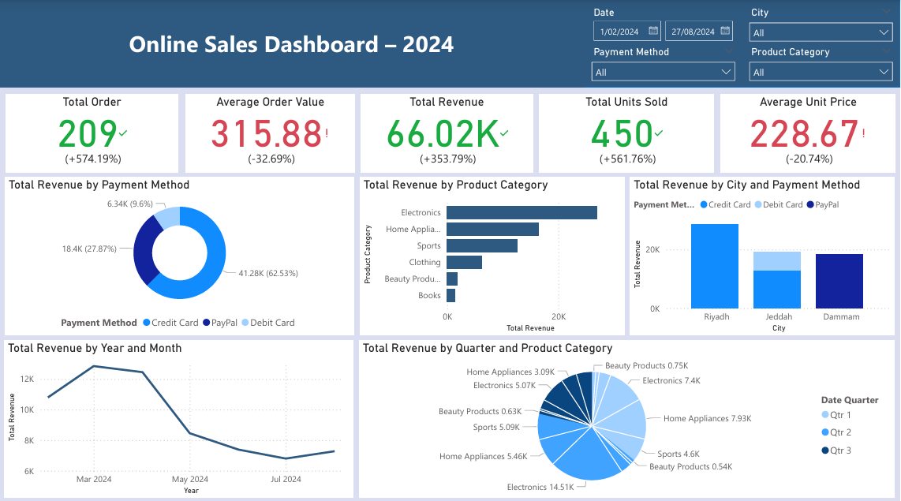

# 📊 Online Sales Dashboard – Power BI Project
This project presents an interactive Power BI dashboard analyzing online sales transactions across various product categories, cities, and time periods. 
The goal is to extract actionable insights to support decision-making in marketing, sales, and operations.

## 📁 Dataset Overview
Source: [Online Sales Dataset](https://www.kaggle.com/datasets/shreyanshverma27/online-sales-dataset-popular-marketplace-data).
Records: Each row represents an online sales transaction.
Columns:
Transaction ID: Unique identifier for each transaction.
Date: Date of the transaction.
Category: Product category (Electronics, Clothing, etc.).
Product Name: Specific product sold.
Unit Sold: Number of units sold.
Unit Price: Price per unit.
Total Price: Quantity × Unit Price.
City: Geographic region (Riyadh, Jeddah, Dammam).
Payment Method: (Credit Card, PayPal).

## 📌 Project Goals
1. Analyze total revenue, order volume, and units sold across different cities and time periods.
2. Track business performance using KPIs like Total Revenue, Average Order Value, and Total Units Sold.
3. Understand customer behavior by payment method and geographic distribution (by city).
4. Allow dynamic filtering and slicing of data by date, category, city, and payment method to support data-driven decisions.

## 💡 Insights
1. Revenue peaked in March, showing strong sales momentum.
2. Riyadh consistently contributed the highest revenue among the cities analyzed.
3. Credit Card was the most frequently used payment method, followed by PayPal.
4. Electronics category performed well in terms of revenue.
5. There was a noticeable decline in revenue in May, indicating a possible seasonal trend or market shift.

## 🧮 DAX Measures Used
```DAX
Average Order Value = 
DIVIDE(
    SUM('Online Sales Data'[Total Revenue]), 
    DISTINCTCOUNT('Online Sales Data'[Transaction ID])
)

Average Unit Price = 
AVERAGE('Online Sales Data'[Unit Price])

Total Unit Sold = 
SUM('Online Sales Data'[Unit Sold])

Revenue Last Month = 
CALCULATE(
    [Total Revenue], 
    PREVIOUSMONTH('Online Sales Data'[Date])
)
```

## 📷 Screenshots

   
